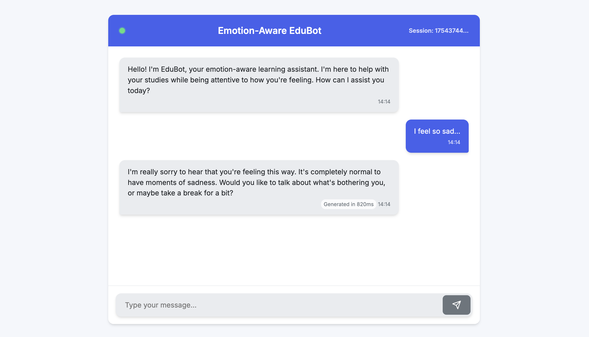
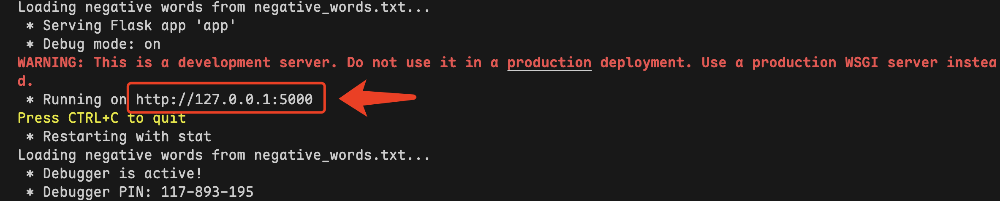

# Emotion-Aware EduBot

## Introduction

**Emotion-Aware EduBot is a proof-of-concept web-based chatbot designed to function as an empathetic AI tutor**. Its primary goal is to assist students with their academic questions while also being attentive to their emotional state. The application intelligently detects signs of negative emotions, such as frustration or stress, and adjusts its conversational approach to provide support and empathy before returning to the educational content.



The core of this application is powered by **OpenAI's `gpt-4o-mini` model**, a sophisticated member of the GPT (Generative Pre-trained Transformer) family. This model provides the foundation for natural language understanding and generation, allowing EduBot to engage in fluid, context-aware conversations. User intent is not identified by traditional, rigid intent recognition algorithms; instead, the large language model interprets the user's goals and meaning from the conversational flow, guided by a detailed system prompt that defines its persona as an empathetic tutor.

A key feature is the multi-faceted emotion and stress detection system, which combines two distinct techniques:

1. **Lexical Sentiment Analysis**: A direct, rule-based approach that scans user messages for keywords defined in an external `negative_words.txt` file. This provides a quick and explicit signal of the user's expressed feelings.

2. **Behavioral Pattern Analysis**: A more subtle, data-driven method implemented on the client-side. JavaScript tracks user interaction metrics such as significant fluctuations in typing speed, high standard deviation in key-press intervals, frequent use of the backspace key, and long pauses before responding. These behavioral markers serve as implicit indicators of cognitive load or emotional distress, allowing the bot to perceive a user's state even when it is not explicitly stated.

**Conversational coherence** is maintained through a stateful session management system. The application stores the history of each conversation in a `deque` structure on the server. For each new message, a sliding window of the most recent turns is sent back to the OpenAI API. This technique provides the model with the necessary context to understand follow-up questions, recall previous points, and ensure the dialogue remains logical and connected over multiple interactions.

The bot operates on the vast internal knowledge of the `gpt-4o-mini` model combined with the immediate conversation history. The `SYSTEM_PROMPT` acts as a foundational guide, instructing the model on its personality, tone, and the specific empathetic protocols to follow when emotional or behavioral stress indicators are detected, effectively shaping its function without a separate knowledge store.


## Environment Setup

Before running the application, you must configure your local environment.

### Prerequisites:
- Python 3.7+

### Dependencies:
This project relies on two main Python libraries: `Flask` for the web server and `openai` to interact with the language model. Create a file named requirements.txt in the root of your project directory and add the following lines:
```bash
Flask>=2.0
openai>=1.0
```

### API Key Configuration:

You need a valid API key from OpenAI. Open the `app.py` file and locate the `OpenAI` client initialization. Replace the placeholder API key with your own secret key.

**It is recommended to use [CloseAI](https://platform.closeai-asia.com/developer/api) to obtain more LLMs.**

```py
client = OpenAI(
    base_url='https://api.openai-proxy.org/v1',  # Don't change if you use CloseAI
    # IMPORTANT: Replace with your actual key, preferably loaded from an environment variable
    api_key='YOUR_OPENAI_API_KEY', 
)
```

### Negative Words File:

Do not move or remove `negative_words.txt`.

## Deployment

Follow these steps to get the application running on your local machine.

### Virtual Environment:

```bash
conda create -n ChatBot python=3.8
conda activate ChatBot
```

### Install Required Packages:

Use `pip` to install the packages listed in your `requirements.txt` file.

```bash
pip install -r requirements.txt
```

### Run the Flask Application:

With your virtual environment activated and dependencies installed, you can now start the Flask development server.

```bash
python app.py
```

The server will start, and you should see output indicating it is running in debug mode and listening for connections, typically on `http://127.0.0.1:5000`.



