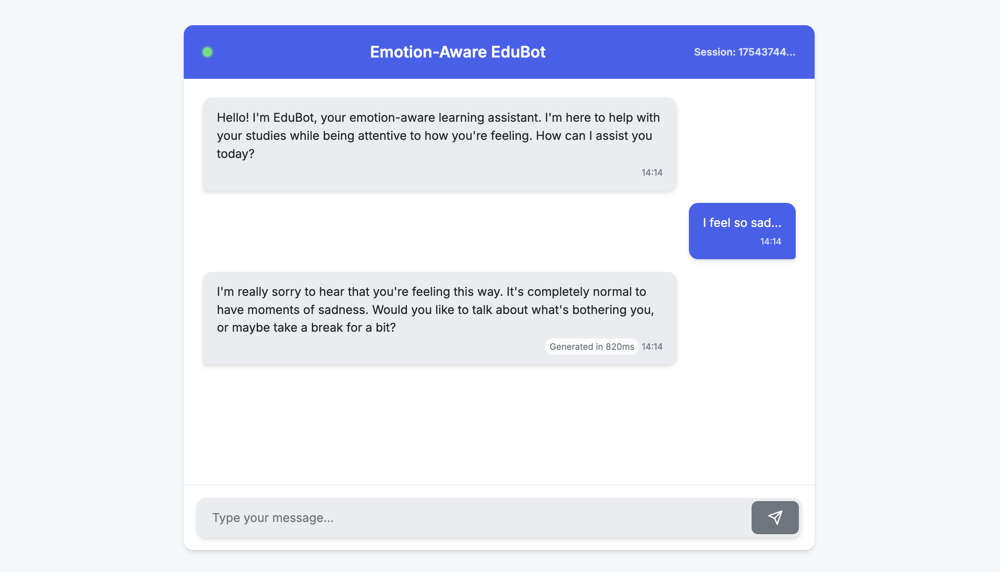
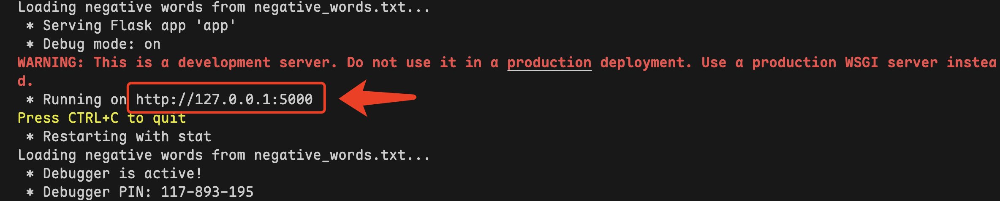

# 情绪识别教育机器人 (Emotion-Aware EduBot)


## 项目简介

**Emotion-Aware EduBot 是一款概念验证型的网页端聊天机器人，旨在担任共情式 AI 导师的角色**。它的核心目标是在协助学生解决学术问题的同时，敏锐地捕捉他们的情绪状态。该应用能够智能地识别诸如挫败或压力等负面情绪信号，并据此调整沟通方式，在回归教学内容之前，优先提供心理支持与情感共情。



该应用的核心由 **OpenAI 的 `gpt-4o-mini` 模型**驱动，该模型是 GPT（生成式预训练变换器）家族中极具性价比的成员。它为自然语言理解与生成奠定了基础，使 EduBot 能够进行流畅且具备上下文感知能力的对话。用户的意图并非通过传统的硬性意图识别算法来识别；相反，大语言模型会根据详细的系统提示词（System Prompt）所定义的“共情导师”人格，从对话流中解读用户的目标和含义。


本项目的关键特性是**多维度的情绪与压力检测系统**，它结合了两种截然不同的技术：

1. **词汇情感分析 (Lexical Sentiment Analysis)**：这是一种直接的、基于规则的方法，通过扫描用户消息中是否包含外部 `negative_words.txt` 文件中定义的关键词，从而快速且明确地捕捉用户表达的情感信号。

2. **行为模式分析 (Behavioral Pattern Analysis)**：这是一种更微妙的、数据驱动的方法，在客户端通过 JavaScript 实现。它追踪用户的交互指标，例如打字速度的显著波动、按键间隔的高标准差、退格键（backspace）的高频使用以及回复前的长久停顿。这些行为标记可作为认知负荷或情绪困扰的隐性指标，使机器人即使在用户没有明确表达情绪时也能感知其状态。

**对话连贯性**通过有状态的会话管理系统维持。应用程序在服务器端使用 `deque` 结构存储每个对话的历史记录。对于每一条新消息，系统会将最近几轮对话的“滑动窗口”发送回 OpenAI API。这种技术为模型提供了必要的背景信息，使其能够理解后续问题、回溯之前的论点，并确保对话在多次交互中保持逻辑一致和连贯。

机器人基于 `gpt-4o-mini` 模型的庞大内部知识库以及即时对话历史运行。`SYSTEM_PROMPT` 起到了基础指南的作用，规定了模型的人格、语气以及在检测到情绪或行为压力指标时需遵循的具体共情协议，从而在无需独立知识库的情况下有效地界定其功能。

---

## 环境配置

在运行应用程序之前，你需要配置本地环境。

### 前置条件：
- `Python 3.7+`

### 依赖项：
本项目主要依赖两个 Python 库：用于 Web 服务器的 `Flask` 和用于与语言模型交互的 `openai`。在项目根目录下创建一个名为 `requirements.txt` 的文件，并添加以下内容：
```bash
Flask>=2.0
openai>=1.0
```

### API 密钥配置：

你需要一个来自 OpenAI 的有效 API 密钥。打开 `app.py` 文件并找到 `OpenAI` 客户端初始化部分。将占位符 API 密钥替换为你自己的密钥。

**推荐使用 [CloseAI](https://platform.closeai-asia.com/developer/api) 来获取更多 LLM 服务。**

```python
client = OpenAI(
    base_url='[https://api.openai-proxy.org/v1](https://api.openai-proxy.org/v1)',  # 如果使用 CloseAI，请勿更改此项
    # 重要提示：请替换为你的实际密钥，建议通过环境变量加载
    api_key='YOUR_OPENAI_API_KEY', 
)
```

### 负面词库文件：

不要移动或删除 `negative_words.txt` 文件。

---

## 部署步骤

按照以下步骤在本地机器上运行应用程序。

### 虚拟环境搭建：

```bash
conda create -n ChatBot python=3.8
conda activate ChatBot
```

### 安装所需软件包：

使用 `pip` 安装 `requirements.txt` 文件中列出的包。

```bash
pip install -r requirements.txt
```

### 运行 Flask 应用程序：

在激活虚拟环境并安装依赖项后，你可以启动 Flask 开发服务器。

```bash
python app.py
```

服务器将启动，你应该会看到输出显示它正在以调试模式运行，并监听连接，通常地址为 `http://127.0.0.1:5000`。

